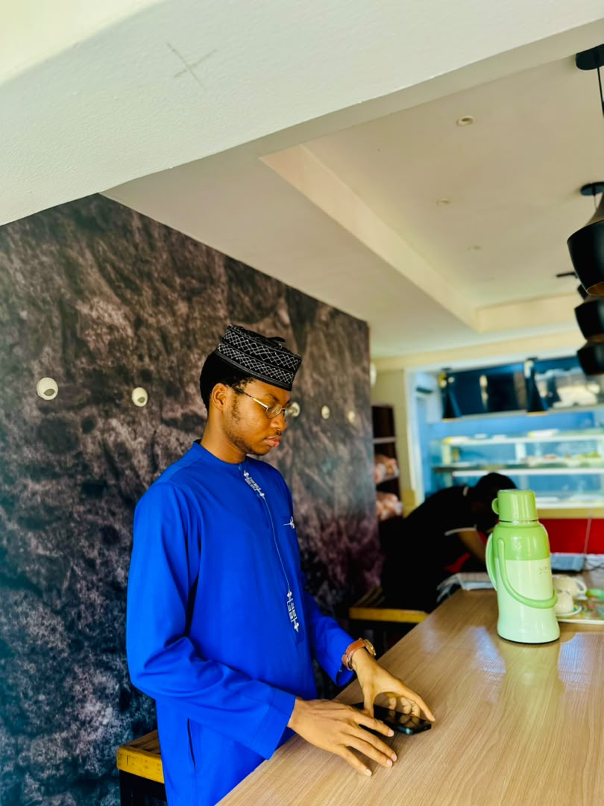
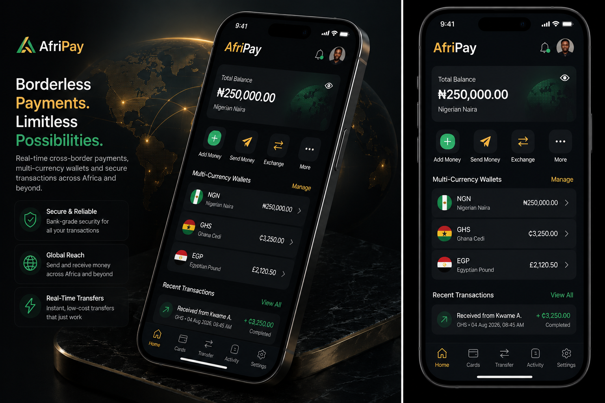
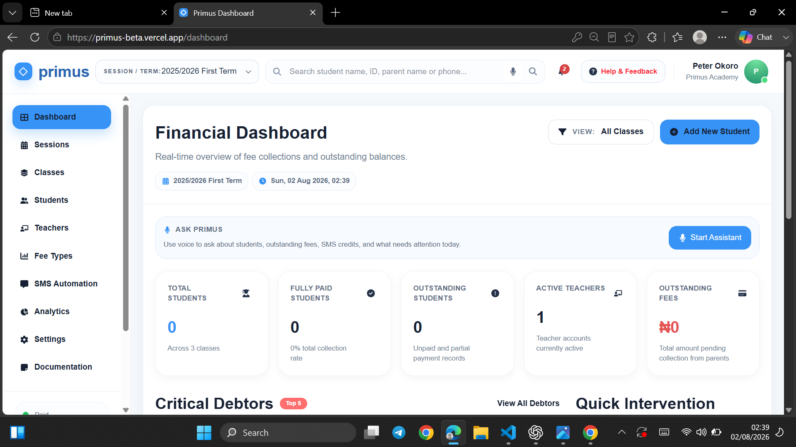

# Darlington Ibe — Portfolio Website

A premium, responsive personal portfolio built with Flutter Web to showcase software engineering projects and product thinking — with a focus on fintech-grade UI polish and a fully functional contact form.

**Live Demo:** 🚧 Deploying soon — link coming shortly.

---

## Screenshots

**Hero Section**


**Featured Project**


**Projects Showcase**


---

## Features

- 🎨 **Premium dark + gold themed UI** — custom-built, not a template
- 📱 **Fully responsive** — distinct, hand-tuned layouts for mobile and desktop, not just a scaled-down breakpoint
- ✨ **Animated hero section** with a glowing accent, circular avatar with live-status indicator on mobile
- 🗂️ **Project showcase** with hover-lift cards, tech stack chips, and live/GitHub links
- 📬 **Functional contact form** — sends directly to email via EmailJS, no backend required
- ⚡ **Smooth section navigation** across Home, About, Skills, Projects, and Contact

---

## Tech Stack

| Category | Technology |
|---|---|
| Framework | Flutter (Web) |
| Language | Dart |
| Contact Form | EmailJS (REST API) |
| Icons | font_awesome_flutter |
| Navigation / Links | url_launcher |
| Hosting | Netlify |

---

## Getting Started

Clone the repo and run it locally:

```bash
git clone https://github.com/darlingtonchizitereib/portfolio-website.git
cd portfolio-website
flutter pub get
flutter run -d chrome
```

To build for production:

```bash
flutter build web --release
```

The output will be in `build/web`, ready to deploy to any static host.

---

## Contact

- **Email:** darlingtonibe09@gmail.com
- **LinkedIn:** [linkedin.com/in/darlington-chizitere-ibe-4ba3613a2](https://www.linkedin.com/in/darlington-chizitere-ibe-4ba3613a2)
- **GitHub:** [@darlingtonchizitereib](https://github.com/darlingtonchizitereib)

---

© 2026 Darlington Ibe. All rights reserved.
